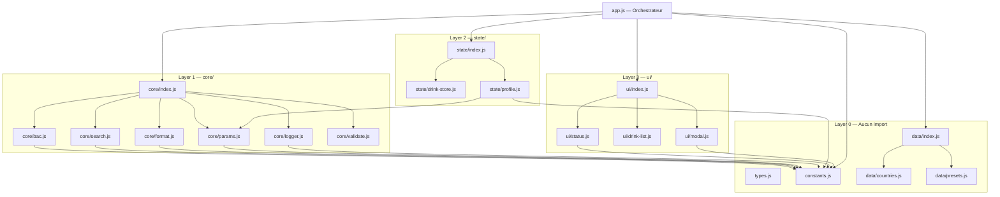
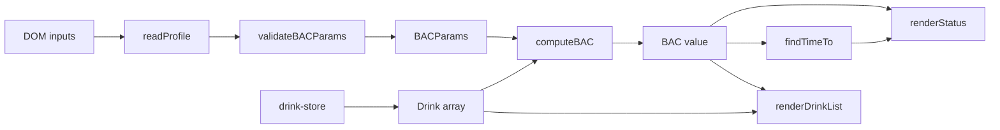

# Architecture — Graphe de Dependances

## Diagramme des Modules

## Points d'Entree

| Entree | Fichier | Description |
|--------|---------|-------------|
| Application | `index.html` | Charge `src/app.js` via `<script type="module">` |
| Orchestrateur | `src/app.js` | Unique point de cablage — importe tous les barrels |
| Tests | `tests/test-runner.html` | Charge et execute les suites de tests |

## Effets de Bord Connus

| Module | Effet de bord | Declencheur |
|--------|---------------|-------------|
| `core/logger.js` | Ecriture `localStorage` + `console.*` | Tout appel `log.*()` |
| `state/drink-store.js` | Appel callback `onChange` | `add()`, `remove()`, `clear()` |
| `state/profile.js` | Lecture DOM (inputs) | `readProfile()` |
| `ui/status.js` | Mutation DOM (panel, timeline) | `renderStatus()` |
| `ui/drink-list.js` | Mutation DOM (liste) | `renderDrinkList()` |
| `ui/modal.js` | Mutation DOM (overlay) + event listeners | `createTimeModal()` |
| `app.js` | `setInterval(update, 30s)` | Boot |

## Contrats d'Interface (API stable)

| Module | Export | Signature | Garanti stable |
|--------|--------|-----------|---------------|
| `core/bac` | `drinkBAC` | `(Drink, BACParams) -> number` | Oui |
| `core/bac` | `computeBAC` | `(Drink[], Date, BACParams) -> number` | Oui |
| `core/search` | `findTimeTo` | `(number, Drink[], Date, BACParams, computeBAC) -> number` | Oui |
| `core/format` | `fmtTime` | `(number, Date) -> string` | Oui |
| `core/format` | `fmtDuration` | `(number) -> string` | Oui |
| `core/params` | `sexFactor` | `(string) -> number` | Oui |
| `core/params` | `elimRate` | `(string, number) -> number` | Oui |
| `core/validate` | `validateDrink` | `(any) -> { valid, reason? }` | Oui |
| `core/validate` | `validateBACParams` | `(any) -> { valid, reason? }` | Oui |
| `core/logger` | `log` | `{ error, warn, info, debug, dump, clear, traceId }` | Oui |
| `state/drink-store` | `createDrinkStore` | `(Function) -> { add, remove, clear, getAll }` | Oui |
| `state/profile` | `readProfile` | `(ProfileDOM, Country[]) -> BACParams` | Oui |

## Flux de Donnees

